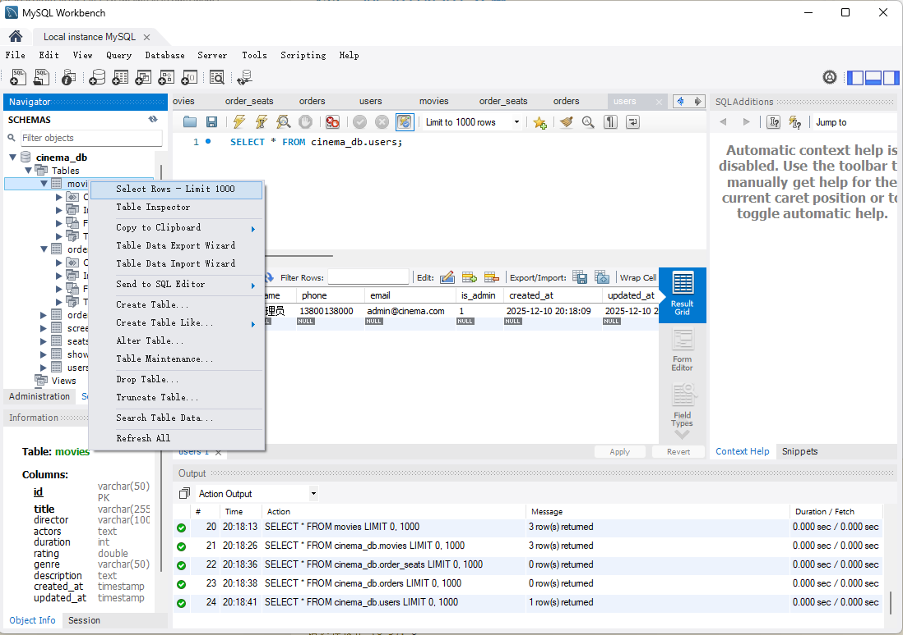
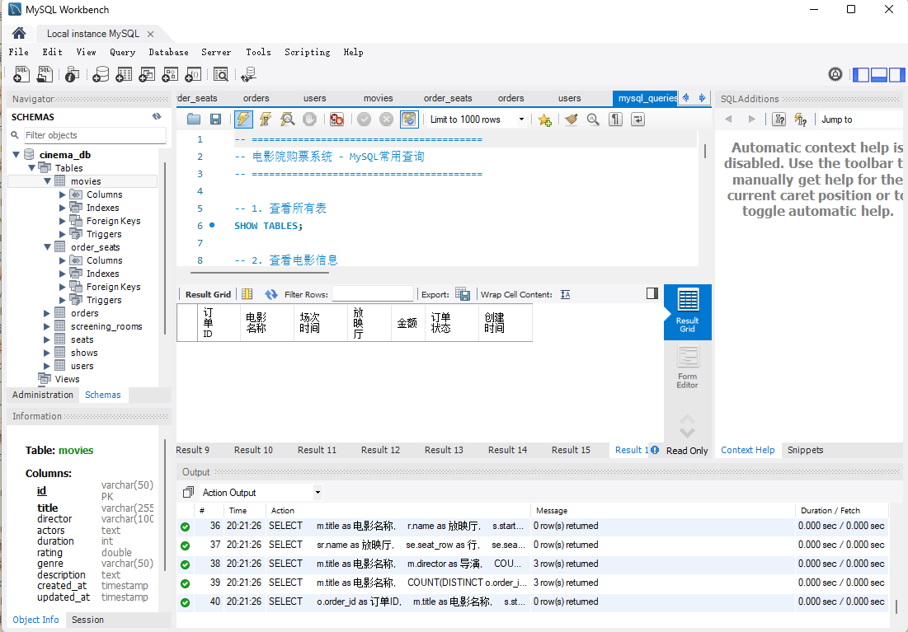
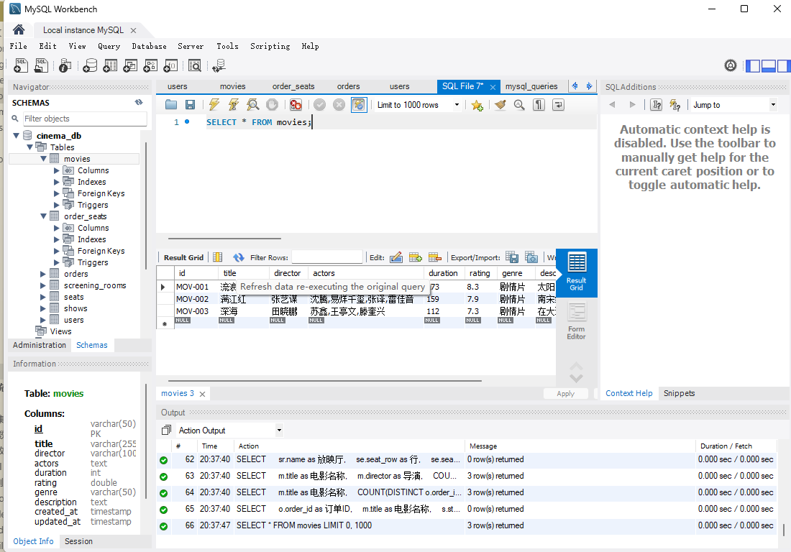
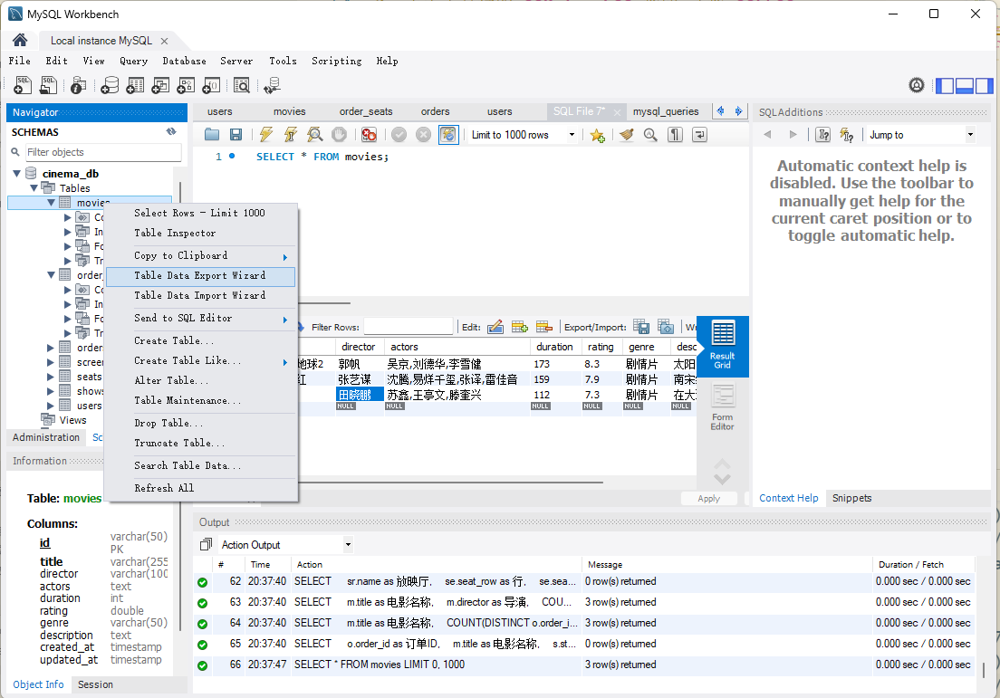
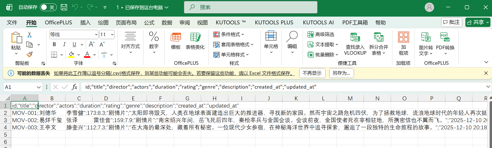

#  **MySQL Workbench 数据查看与管理指南**

## **1. 查看数据库中的数据**

### **方法 1：使用图形界面（推荐）**

1. 打开 MySQL Workbench，连接你的数据库
2. 在左侧 **Navigator** 面板选择 **SCHEMAS**
3. 展开你的数据库（例如：`cinema_db`）
4. 展开 **Tables** 查看所有表
5. 右键某个表 → **Select Rows - Limit 1000**
   即可查看表中的数据

---

### **方法 2：使用 SQL 查询窗口**

1. 点击菜单 **File → Open Script**
2. 选择你的 SQL 文件（如：`mysql_queries.sql`）
3. 将需要执行的 SQL 语句选中
4. 点击闪电按钮或按 `Ctrl + Enter` 执行

---

## **2. 查看表结构**

点击File下面的图标（create a new sql lab...），复制以下内容到表中。按⚡执行file。

```sql
-- 切换到 cinema_db
USE cinema_db;

-- 查看所有表
SHOW TABLES;

-- 查看表的结构字段
DESC movies;
DESC shows;
DESC orders;
```

执行后你可以看到字段、类型、主键、是否允许为空等信息。

---

## **3. 实时监控数据变化**

1. 在查询窗口执行查询：

   ```sql
   SELECT * FROM movies;
   ```
2. 点击工具栏的 **Refresh** 按钮 或按 **F5**
3. Workbench 会重新查询数据库并显示最新数据

适用于调试后端新增、删除、修改数据的情况。

---

## **4. 导出数据（备份 / 分析用）**

1. 右键你需要导出的表
2. 选择 **Table Data Export Wizard**

3. 选择输出格式：

   * CSV
   * JSON
   * SQL Insert文件
4. 选择保存位置
5. 点击 **Finish** 完成导出
