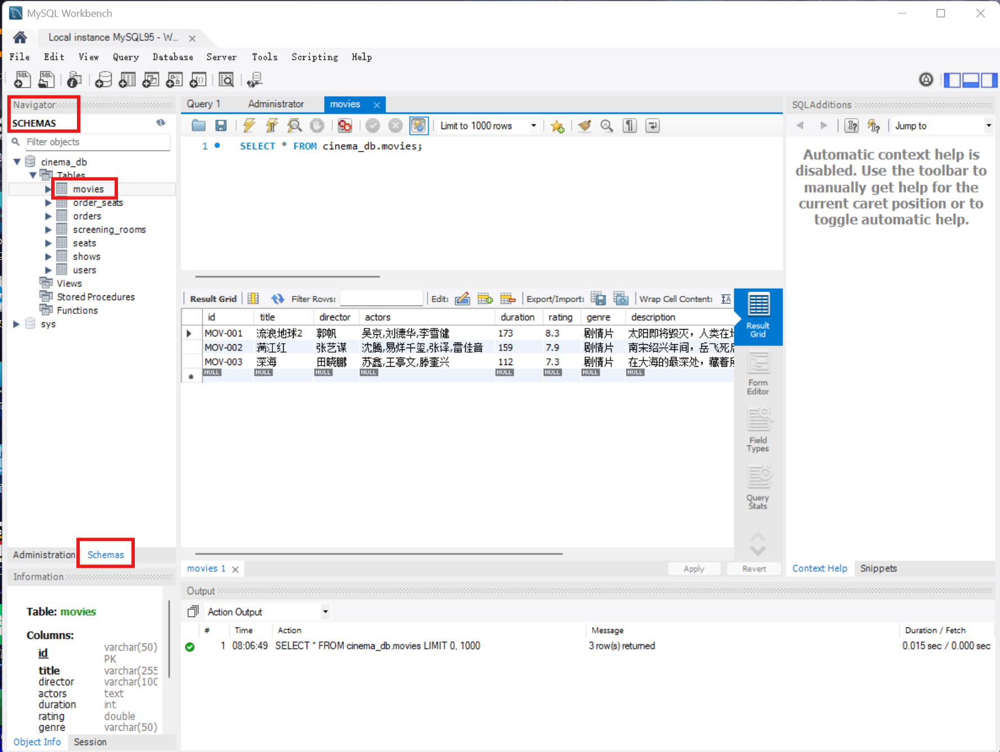
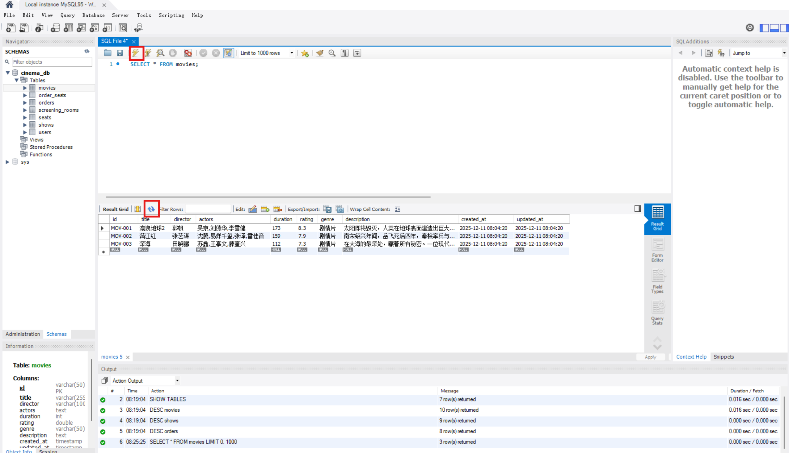
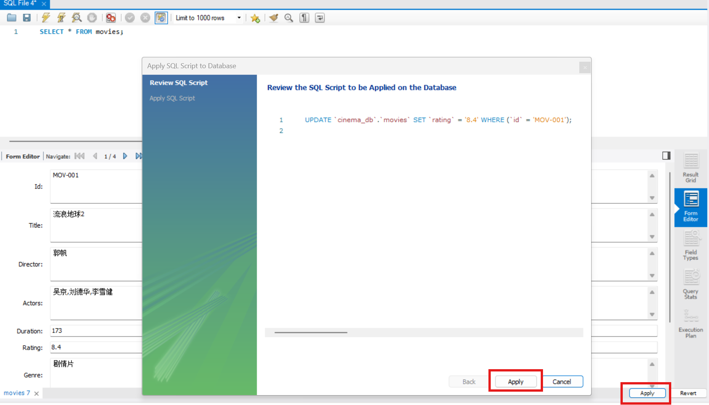

# MySQL 数据查看与管理指南

以下内容适用于所有使用 **MySQL Workbench** 或 **MySQL 命令行（CLI）** 操作数据库的用户，特别是在进行项目开发、调试与数据维护时。

## 1. 查看数据库中的数据

### 方法 1：使用 MySQL Workbench 图形界面（推荐）

1. 打开 MySQL Workbench，连接数据库
2. 左侧 **Navigator → SCHEMAS**
3. 展开数据库（如 `cinema_db`）
4. 展开 **Tables**
5. 右键任意表 → **Select Rows - Limit 1000**

即可查看数据。

如果你并没有看到图示界面，你大概率没有连接数据库



### 方法 2：使用 SQL 查询窗口

在 Workbench 中：

1. 打开一个新的 SQL 文件（闪电图标旁的文件夹按钮，文件类型 `.sql` ）
2. 输入或打开 SQL 文件
3. 选中要执行的 SQL
4. 点击 **闪电按钮** 或按 **Ctrl + Enter**

例如：

```sql
SELECT * FROM movies;
```

注意：执行之前，务必在左侧选择执行数据库，否则等着报错吧


### 方法3：命令行（Command Line）

首先务必确认mysql已经加入环境变量。

在任意位置打开终端，执行：

```sql
mysql -u root -p #这个命令输入后，会提示你输入ROOT的密码
USE cinema_db;
SELECT * FROM movies;
```


## 2. 查看表结构

### Workbench：SQL 编辑器中执行

```sql
USE cinema_db;
SHOW TABLES;
DESC movies;
DESC shows;
DESC orders;
```


### 命令行

```sql
-- 注意：你得先登录，否则查询空气
USE cinema_db;
DESC movies;
```

你将看到字段名、数据类型、主键、是否允许为空等信息。


## 3. 实时刷新数据（调试常用）

### Workbench

1. 执行：

```sql
SELECT * FROM movies;
```

2. 点击工具栏的 **Refresh**（圆形循环箭头）或按 **F5**

Workbench 会重新向数据库请求最新数据。

如果你没看到循环箭头，可以直接再次点击闪电图标（这样的话效率更快）



### 命令行

重新执行查询即可：

```sql
SELECT * FROM movies;
```

## 4. 数据增删改查（CRUD）

以下的写法在 **Workbench + 命令行** 均可行。

### 4.1 插入数据（INSERT）

```sql
INSERT INTO movies (movie_name, duration)
VALUES ('Inception', 148);
```

Workbench 中点击闪电执行即可。

### 4.2 修改数据（UPDATE）

```sql
UPDATE movies
SET duration = 150
WHERE movie_id = 2;
```

如果是表格模式，必须 Apply -> Apply -> Finish



如何知道是否自动保存？

首先执行：

```mysql
SELECT @@autocommit;
```

如果返回 1 ，则可以自动保存（提交）

否则执行：

```mysql
SET autocommit = 1;
```

即可开启自动保存

### 4.3 删除数据（DELETE）

```sql
DELETE FROM orders
WHERE order_id = 10;
```

如果是表格中手动删除，也要Apply

```mysql
COMMIT;
```

即使你开了自动提交也最好执行一下

### 4.4 查询数据（SELECT）

```sql
SELECT * FROM orders;
SELECT movie_name FROM movies WHERE duration > 120;
```

## 5. 保存或撤销更改（Commit / Rollback）

### Workbench

* 如果是SQL 编辑器执行 DELETE/UPDATE → 自动提交
* 如果是表格模式编辑，必须手动点击：Apply（保存）或者Rollback（撤销）

如果出现提示：

```
There are pending changes. Please commit or rollback first.
```

点击 **Rollback**

### 命令行

手动执行：

```sql
START TRANSACTION;
UPDATE movies SET duration = 150;
COMMIT;   -- 保存修改
ROLLBACK; -- 取消修改
```

---

## 6. 导出数据（备份 / 分析）

### Workbench

1. 右键目标表
2. 选择 **Table Data Export Wizard**
3. 选择导出格式：

* CSV
* JSON
* SQL Insert 文件

4. 选择保存路径
5. 点击 **Finish**


### 命令行导出

使用 `mysqldump`：

```bash
mysqldump -u root -p cinema_db > cinema_db_backup.sql
```

## 完整总结

| 操作   | Workbench（GUI）           | SQL（Workbench/CLI）     |
| ---- | ------------------------ | ---------------------- |
| 查看数据 | 右键表 → Select Rows        | `SELECT * FROM table;` |
| 查看结构 | Table Inspector / DESC   | `DESC table;`          |
| 插入   | SQL 或表格 + Apply          | `INSERT INTO ...`      |
| 修改   | 表格修改 + Apply             | `UPDATE ...`           |
| 删除   | 表格删除 + Apply             | `DELETE ...`           |
| 刷新   | Refresh 按钮               | 重新 SELECT              |
| 导出   | Table Data Export Wizard | `mysqldump`            |

